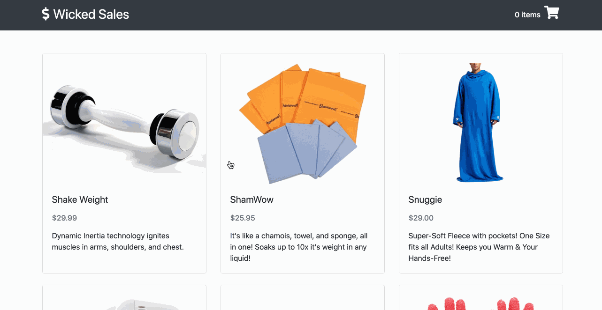

# Wicked Sales
A full stack Node.js and React.js shopping cart app.

## Technologies Used
- React.js
- Webpack 4
- Babel
- Bootstrap 4
- Node.js
- Express.js
- PostgreSQL
- HTML5
- CSS3
- AWS EC2

## Live Demo
Try the application live at https://wicked-sales.themichaelzhu.com/

## Features
- User can view the products for sale
- User can view the details of a product
- User can add a product to their cart
- User can view their cart summary
- User can place an order

## Preview


## Development
### System Requirements
- Node.js 10 or higher
- npm 6 or higher
- postgreSQL

### Getting Started
1. Clone the repository.
    ```shell
    git clone https://github.com/michaelzhu23/wicked-sales-js.git
    cd wicked-sales-js
    ```
2. Install all dependencies with NPM.
    ```shell
    npm install
    ```
3. Import the example database to PostgreSQL database.
    ```shell
    npm run db:import
    ```
4. Start the project. Once started you can view the application by opening http://localhost:3000 in your browser.
    ```shell
    npm run dev
    ```
